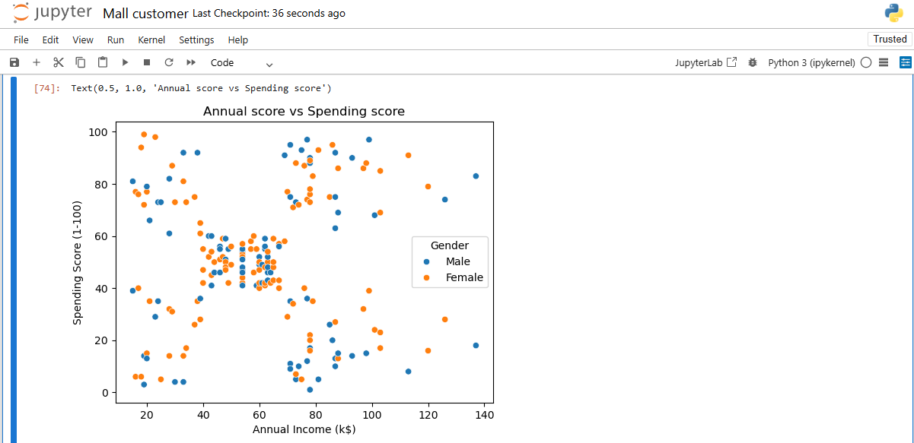
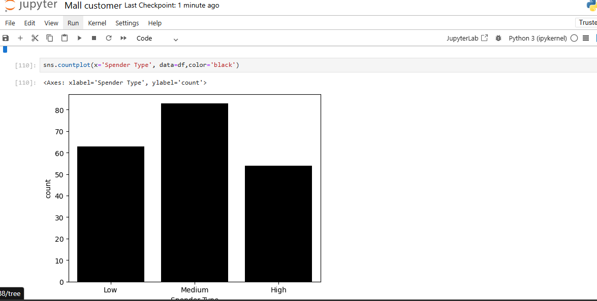
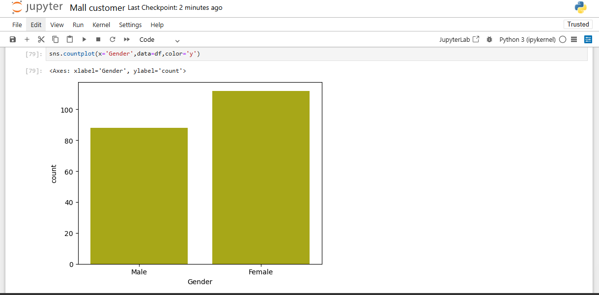
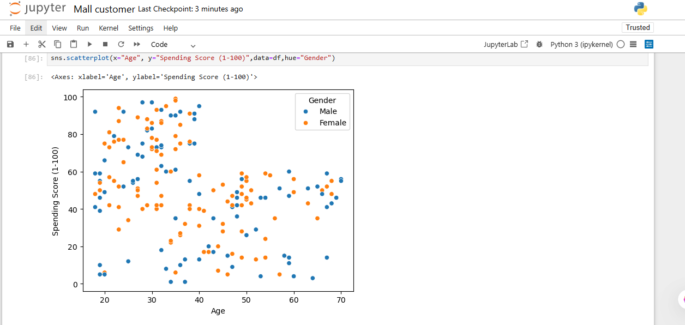

#  Mall Customer Analysis Project

##  Objective
The objective of this project is to analyze mall customer data to understand customer behavior based on age, gender, annual income, and spending score. The goal is to identify patterns and insights that can help in better customer targeting.

##  Dataset
The dataset contains the following columns:

- Customer ID  
- Age  
- Gender  
- Annual Income  
- Spending Score  

This dataset represents mall customers and their purchasing behavior.

## Tools Used
- Python  
- Pandas  
- NumPy  
- Matplotlib  
- Seaborn  

##  Steps Performed

### 1. Importing Libraries
Imported required Python libraries for data analysis and visualization.

### 2. Loading Dataset
Loaded the dataset using Pandas and viewed the initial rows.

### 3. Understanding Data
Checked data structure using:
- `info()`
- `describe()`

### 4. Data Cleaning
- Checked missing values  
- Checked duplicates  
- Removed duplicate records (if any)  

### 5. Exploratory Data Analysis (EDA)
Performed analysis to understand:
- Gender distribution  
- Age distribution  
- Income patterns  
- Spending behavior  

### 6. Data Visualization
Created visualizations using:
- Bar plots  
- Scatter plots  
- Count plots  

To understand relationships between variables.

## 📊 Visualizations

### Annual score vs spending score
This graph shows how an annual income of a customer affects on the spending of a customer.

### Customer segmentation
This graph shows the types of customer.

### Gender Distribution
This graph shows distribution of male and female customers.

### Age vs Spending Score
This graph shows relationship between age and spending behavior.

 

### 7. Insights Extraction
Derived meaningful business insights from the analysis.

##  Key Insights

- Female customers show higher average spending compared to male customers.  
- Male customers have higher average income but lower spending scores.  
- Customers aged between 26–30 are high spenders.  
- Spending behavior is not directly dependent on income level.  
- Customer segmentation can help improve marketing strategies.  

